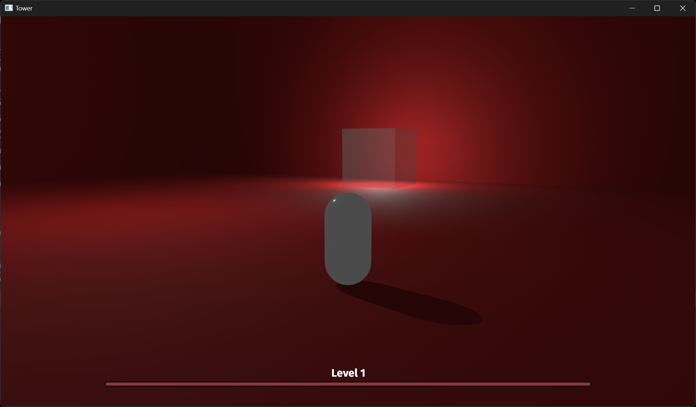

# Tower game

Simple TPS game with Bevy 0.13. Move with WASD, dash with SPACE, look around, zoom in and out with the mouse wheel, left click to shoot.

Shots and dashes have cooldowns, which are not visible yet. Shots are physical bullets that collide with the environment.

If a bullet touches the enemy box, it deals one damage point. The enemy has a total health equal to the number of the level. When the enemy dies, a new level is created right above the previous one, with a hue-shifted new color. There is no level limit for now.

